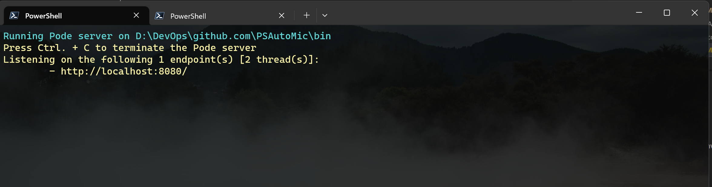
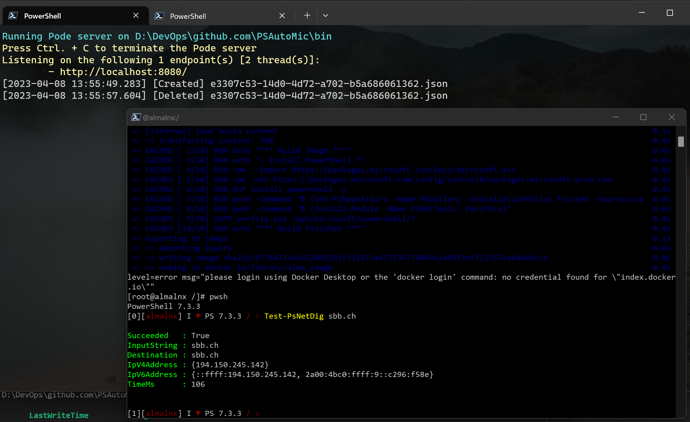
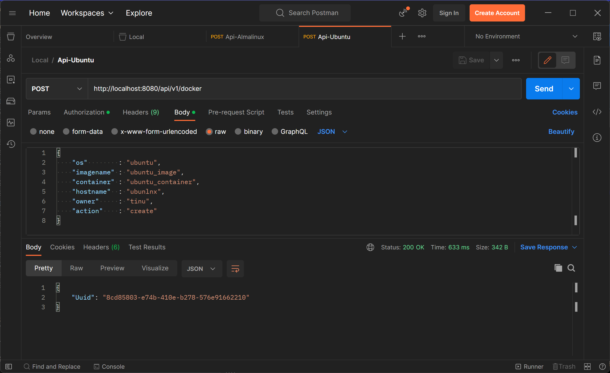
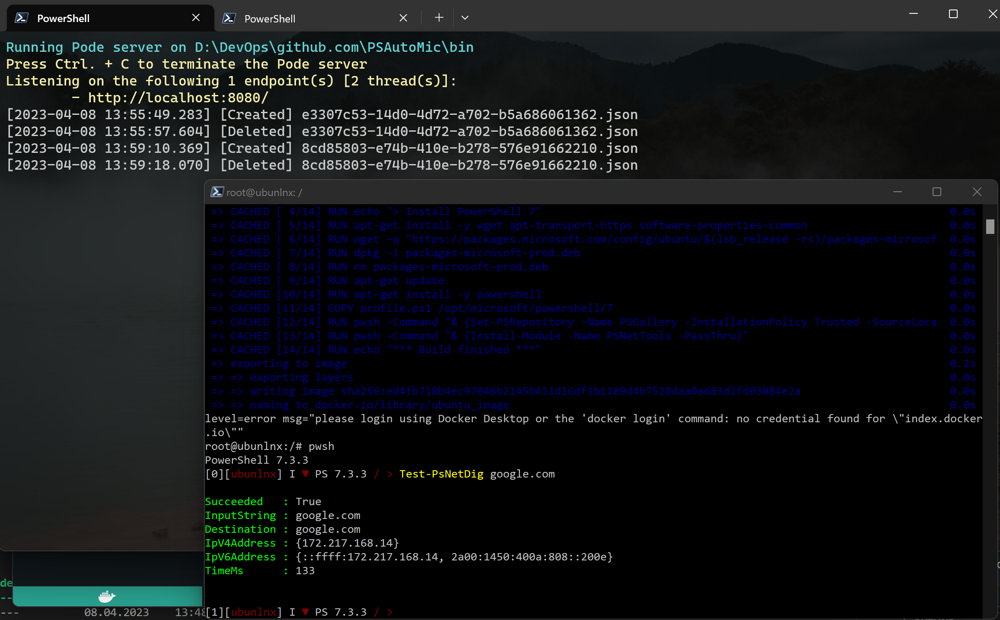
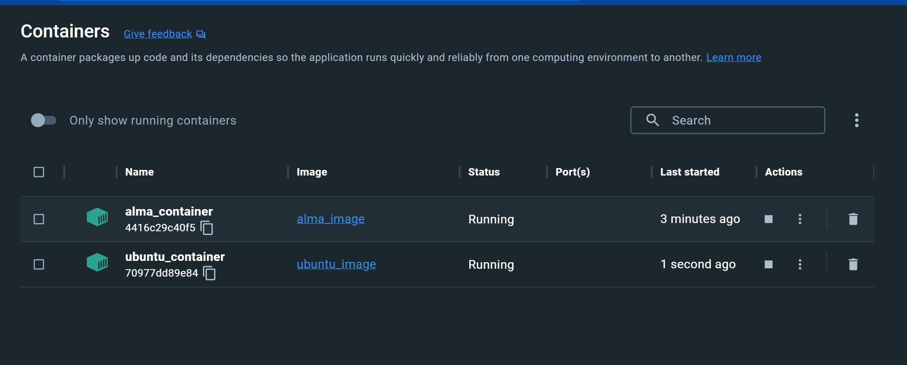

# PowerShell RestAPI

Example with Pode Rest APIs. In this example I demostrate how you can create and delete a Docker Image and Container over RestAPI.

````mermaid
sequenceDiagram
    Postman->>RestAPI: invoke request
    RestAPI->>FileWatcher: queue result
    RestAPI->>FileWatcher: queue result
    FileWatcher->>Docker: new docker container
    FileWatcher->>Docker: del docker container
    FileWatcher->>Docker: new docker container
````

## Requirements

This example require the following PowerShell Modules:

- Microsoft.PowerShell.SecretManagement
- SecretManagement.KeePass
- Pode

You need also to install Docker Desktop and KeePass on your computer.

## Configure KeePass

Create a KeePassDB with the name 'PSOctomes' on your computer and define an Entry with a Username and Password for the Bearer Token that you can access the RestAPI.  
Modify the script Config-Secrets.ps1 and enter the path to your KeePass-File.  
Execute the script Config-Secrets.ps1.

## Start Pode RestAPI

Open a PowerShell or Terminal and start the Pode server. If you send the Request the first one, you have to enter the KeePass Master Password.

````powershell
.\PSAutoMic\bin\Start-PSAutoMic.ps1

Running Pode server on D:\DevOps\github.com\PSAutoMic\bin
Press Ctrl. + C to terminate the Pode server
Listening on the following 1 endpoint(s) [2 thread(s)]:
        - http://localhost:8080/

Keepass Master Password
Enter the Keepass Master password for: C:\Users\Admin\OneDrive\Do*ument*\PSOctomes.kdbx
Password for user Keepass Master Password: ********
````



## Request a Linux over PowerShell

Request your first almalinux over RestAPI.

````powershell
$BearerToken = ""
$headers = @{
    'Content-Type'  = 'application/json'
    'Authorization' = "Bearer $BearerToken"
}

$body = @{
    os        = 'almalinux'
    imagename = 'almal_image'
    container = 'almal_container'
    hostname  = 'almalnx'
    owner     = 'tinu'
    action    = 'create'
} | ConvertTo-Json -Compress

$Properties = @{
    Method  = 'POST'
    Headers = $headers
    Uri     = "http://localhost:8080/api/v1/docker"
    Body    = $body
}
$response = Invoke-RestMethod @Properties
````

Almalinux is created:



## Remove a Linux over PowerShell

Remove your almalinux over RestAPI.

````powershell
$BearerToken = ""
$headers = @{
    'Content-Type'  = 'application/json'
    'Authorization' = "Bearer $BearerToken"
}

$body = @{
    os        = 'almalinux'
    imagename = 'almal_image'
    container = 'almal_container'
    hostname  = 'almalnx'
    owner     = 'tinu'
    action    = 'delete'
} | ConvertTo-Json -Compress

$Properties = @{
    Method  = 'POST'
    Headers = $headers
    Uri     = "http://localhost:8080/api/v1/docker"
    Body    = $body
}
$response = Invoke-RestMethod @Properties
````

## Request a Linux over Postman

Send a RestAPI call to create a ubuntu over Postman:



Ubuntu is created:



Docker containers:



## Watch the video

[](./img/PodeRestAPI.mp4)
